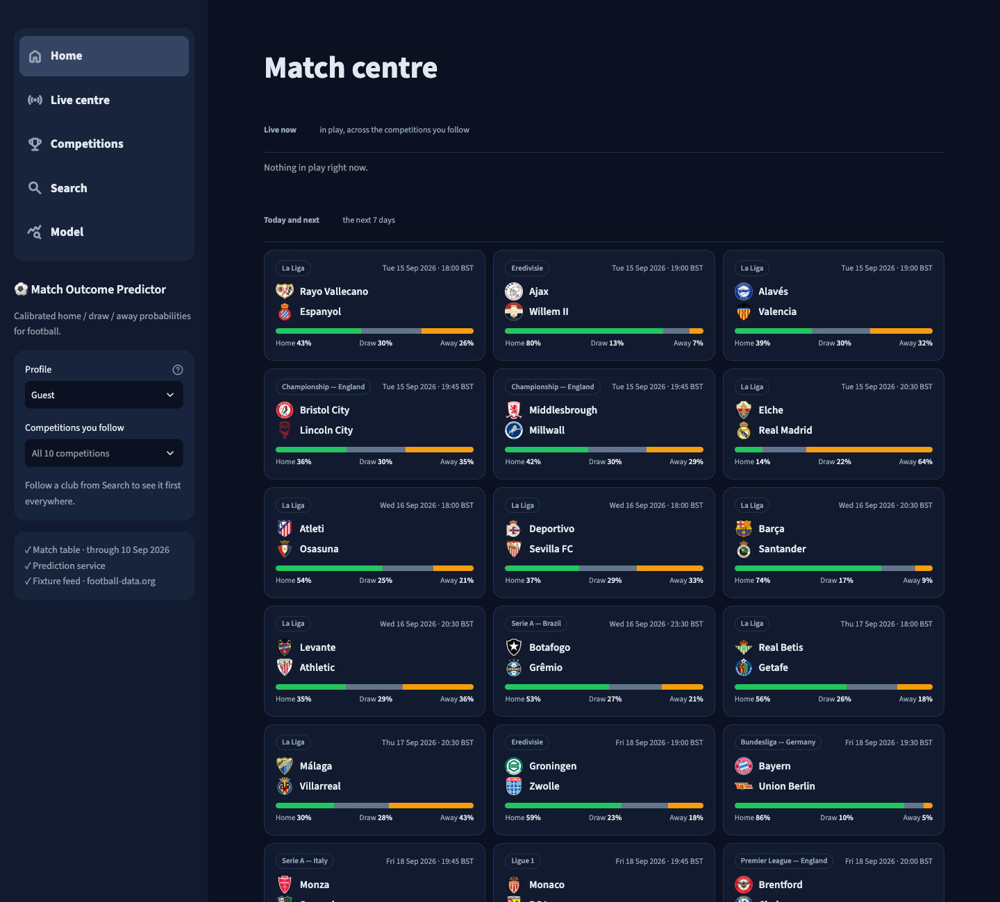
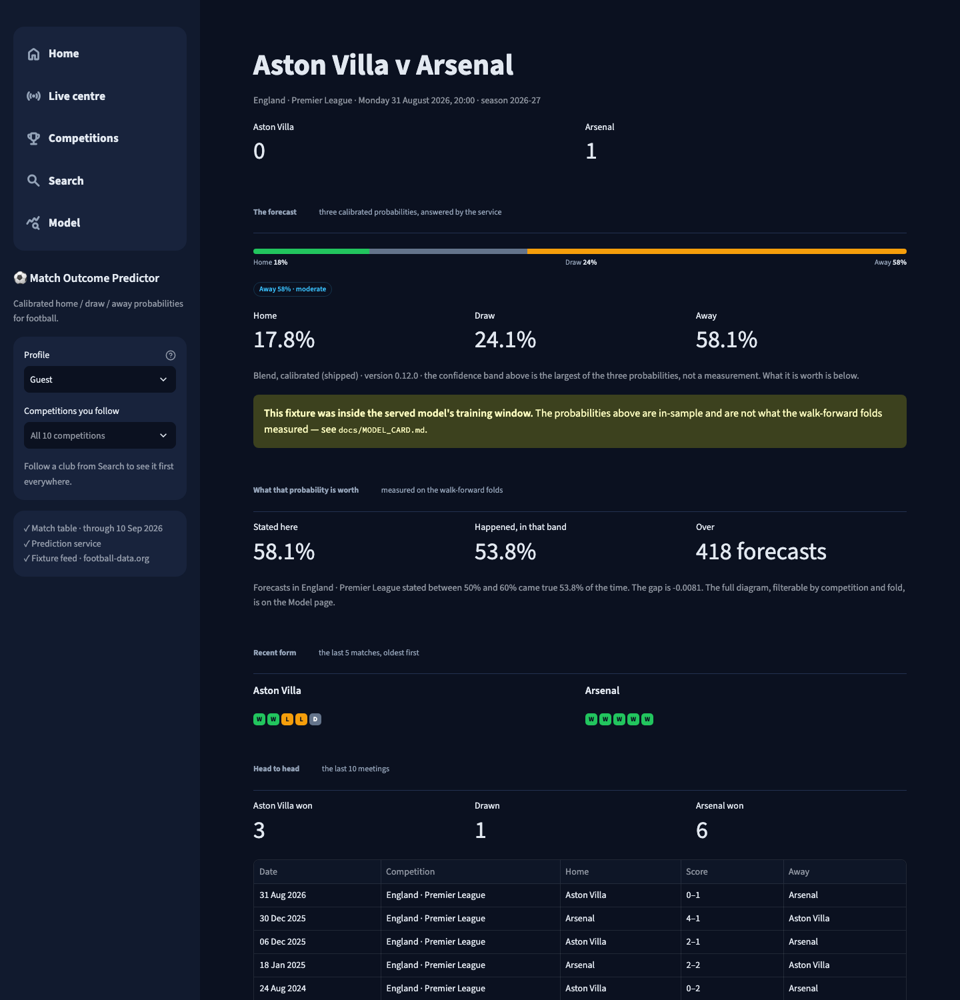
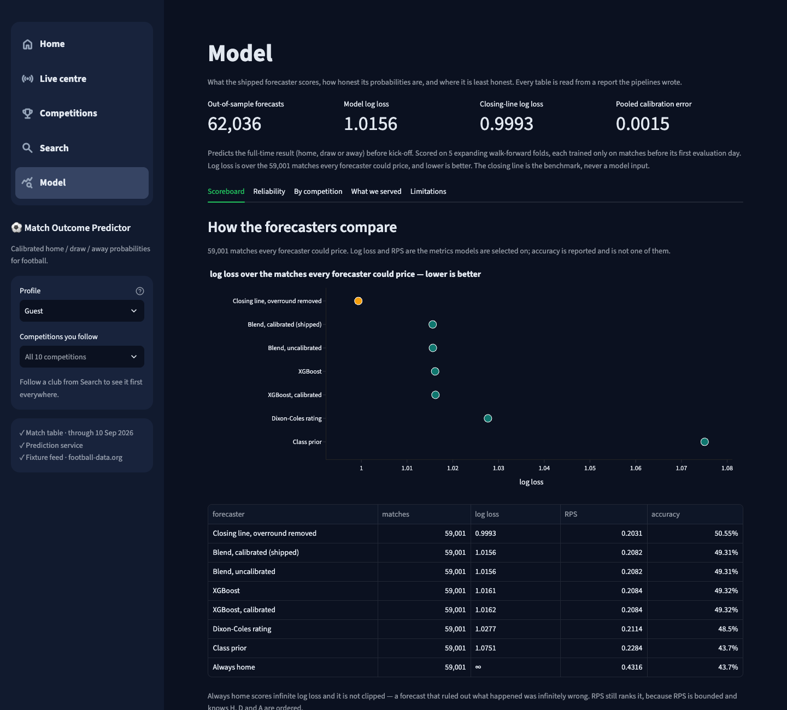

# Match Outcome Predictor

Calibrated home / draw / away probabilities for football matches, evaluated
out-of-sample and benchmarked against the bookmaker's closing line.

[](https://github.com/Vanshcloud/Match-Outcome-Predictor/actions/workflows/ci.yml)


| | Measured | |
|---|---:|---|
| Out-of-sample forecasts | **62,036** | five expanding walk-forward folds |
| Log loss, shipped blend | **1.0156** | on the 59,001 matches every forecaster could price |
| Log loss, closing line | **0.9993** | the benchmark — the model is behind it in every competition |
| Pooled calibration error | **0.0015** | over 186,108 probability statements |

## Overview

The project runs end to end, from raw results to a served model:

1. Ingests **303,517 matches** from 39 competitions in 27 countries (July 1993
   to September 2026) into one validated schema.
2. Builds two causal team ratings and twenty pre-match features.
3. Fits six model families on walk-forward folds, blends and calibrates them,
   and scores everything against four baselines, including the closing line.
4. Serves the calibrated blend from a FastAPI service.
5. Shows forecasts, live scores and the model's reliability in a Streamlit
   dashboard for the 10 competitions on football-data.org's free plan.

## Why this project

Football predictions are usually reported as a hit rate. A hit rate hides
whether the stated probabilities can be trusted, and it is easy to inflate with
information that was not available before kick-off.

This project treats the problem as probabilistic forecasting. It asks whether
a stated 60% happens about 60% of the time, checks by recomputation that no
input could have seen the result, and compares itself with the strongest public
benchmark there is: the market's closing price. The model does not beat that
benchmark, and the project reports that plainly.

## Key capabilities

| | |
|---|---|
| Data | Incremental, checksummed ingest of football-data.co.uk CSVs; a 35-column canonical schema; 24 validation checks on every ingest; a generated dataset card |
| Features | Elo and Dixon-Coles ratings plus 20 form, schedule and head-to-head features, each a window over matches strictly before kick-off |
| Leakage control | Recomputation probes over every feature and rating producer, and a split-boundary probe on every fold; both run in CI |
| Models | Logistic regression, random forest, XGBoost, LightGBM, CatBoost and an MLP; a blend chosen on error correlation; temperature scaling |
| Evaluation | Log loss, ranked probability score (RPS) and accuracy on five walk-forward folds; reliability tables; a generated model card |
| Serving | FastAPI with checksum-verified artefacts, an `in_sample` flag on every response, Prometheus metrics, an optional PostgreSQL prediction log |
| Dashboard | Home, live centre, competitions, match, search and model pages; live scores and club crests; saved favourites; optional webhook notifications |
| Closing the loop | Upcoming fixtures are priced before kick-off, logged, and scored once their results are ingested |

## Dashboard

Captured from the running dashboard with the live football-data.org feed
connected. Every measured figure on these pages is read from the report tables
of the snapshot described under
[Data and reproducibility](#data-and-reproducibility); the match table behind
the sidebar's date and the fixtures behind the cards are whatever was current
when the screenshot was taken, which is why the two dates differ.


*Home: matches in play and the next seven days, each fixture with the model's
probabilities. Scores and crests are served at runtime by football-data.org;
the crests belong to their clubs, and none are stored in this repository.*


*Match page: the forecast, how often forecasts in the same probability band came
true in that competition, form and head-to-head. This match is inside the
served model's training window, and the page says so.*


*Model page: headline numbers, every forecaster on the same matches, and tabs
for reliability, per-competition results and limitations.*

| Page | Contents |
|---|---|
| Home / Live centre | Live matches and the coming week's fixtures with probabilities; the live strip refreshes every 60 s |
| Competitions | The nine covered leagues plus the Champions League; each page lists the coming week's fixtures |
| Match | The forecast and its reliability band; form and head-to-head for a played match |
| Search | A club's crest, live and upcoming fixtures, and results |
| Model | Every forecaster on the same matches; reliability by competition and year; the served-forecast archive; limitations |

The dashboard is a client of the API over HTTP. Without data or a running
service it still starts, and each section says what is missing and which
command produces it.

## ML methodology

**Target.** The full-time result: home win, draw or away win. The model
outputs a probability for each.

**Features.** Thirty design columns, all computed from matches strictly before
kick-off:
- *Elo*, one pool per country, updated online. Its constants were fitted on
  matches before 2005-07-01.
- *Dixon-Coles*, a bivariate Poisson with a low-score correction and time
  decay, refitted per competition on a window ending before the refit date.
- *Twenty window features*: form, venue form, goals and shots over the last
  five matches, rest days, fixture congestion and head-to-head. Windows cut on
  the **date**, not the row, so two matches on the same day never inform each
  other.

Odds are **not** a model input. They are the benchmark, and a test fails if any
feature reads them.

**Temporal validation.** Five expanding walk-forward folds of 365 days,
anchored at the latest match. Each fold trains only on matches strictly before
its first evaluation day:

| Fold | Trains to | Scores (end exclusive) | Matches |
|---|---|---|---:|
| 0 | 2021-09-02 | 2021-09-03 → 2022-09-03 | 13,030 |
| 1 | 2022-09-02 | 2022-09-03 → 2023-09-03 | 12,302 |
| 2 | 2023-09-02 | 2023-09-03 → 2024-09-02 | 12,503 |
| 3 | 2024-09-01 | 2024-09-02 → 2025-09-02 | 12,399 |
| 4 | 2025-09-01 | 2025-09-02 → 2026-09-02 | 11,802 |

**Models and blend.** Hyperparameters were tuned with Optuna on a slice that
ends before the first reported fold. The shipped model is the unweighted mean
of XGBoost, logistic regression and the MLP. Members are admitted best-first
when their per-match errors correlate below 0.99 with every member already in;
the other tree models correlate at 0.993–0.996 with XGBoost, so only one tree
is kept.

**Calibration.** One temperature, `p^(1/T)`, fitted on the last 365 days of
each fold's training half, with the model refitted on everything before that.

**Leakage prevention.**
- Each feature declares the canonical columns it reads, in a registry.
- Four recomputation probes (`src/validation/temporal.py`): truncating the
  history must not change surviving rows; rewriting a scoreline must not change
  that match's own row; any row that moves when an input column is rewritten
  must be declared as reading it; no training row may be dated on or after an
  evaluation row.
- The suite discovers every producer by walking the packages, and checks that
  planted leaks (a shuffled split, a split through a matchday, a feature
  reading the odds) are caught.
- Imputation, scaling, tuning, member selection and calibration all see only
  data before the evaluation half.

**Disclosed caveat.** Some rating settings were chosen by looking at data that
overlaps the reported folds: the Dixon-Coles decay, window and refit interval
(chosen on the Premier League, then checked against three competitions that had
no say in them), and which Elo refinements to keep. A probe perturbs data and
these travelled through a person, so nothing above catches them; they are a
handful of scalars on a flat response surface, and the reported figures are
optimistic by an unmeasured amount.
[RATINGS](docs/RATINGS.md#do-the-settings-transfer) has the transfer table and
[LEAKAGE](docs/LEAKAGE.md#what-the-trace-cannot-tell-you) says why the probes
cannot reach it. [docs/LEAKAGE.md](docs/LEAKAGE.md) traces all thirty columns.

## Results

All numbers below are out-of-sample, from the five folds above. The table and
the per-competition comparisons are on the 59,001 matches that the bookmaker and
Dixon-Coles could both price.

| Forecaster | Log loss | RPS | Accuracy |
|---|---:|---:|---:|
| Bookmaker closing odds, overround removed (benchmark) | **0.9993** | **0.2031** | 50.6% |
| **Blend of three, calibrated (shipped)** | **1.0156** | **0.2082** | 49.3% |
| CatBoost | 1.0159 | 0.2083 | 49.2% |
| XGBoost / LightGBM / logistic regression | 1.0161–1.0162 | 0.2083–0.2084 | 49.2–49.3% |
| Random forest | 1.0172 | 0.2087 | 49.2% |
| MLP | 1.0203 | 0.2091 | 49.1% |
| Dixon-Coles rating alone | 1.0277 | 0.2114 | 48.5% |
| Class prior, counted per fold | 1.0751 | 0.2284 | 43.7% |

Log loss and RPS are the primary metrics; RPS respects the ordering H > D > A.
Accuracy is reported last: draws are about a quarter of matches and are almost
never the single most likely outcome.

- **The model is behind the closing line in all 39 competitions,** by
  0.0163 ± 0.0007 of log loss (standard error of the per-match difference). A
  model that beat the closing line on public data would more likely have a leak
  than an edge.
- **The top models are nearly level.** The blend is 0.0005 better than XGBoost
  and 0.0003 better than CatBoost; paired over 193 fold × competition cells,
  those gaps are about 2.4 and 1.4 standard errors.
- **The gap to the market is concentrated.** Over the 61,889 matches the model
  and the market could both price: where the model is within 2% of the closing
  line (9,628 forecasts) it is level with it (+0.0009); where it is more than
  20% away (829 forecasts) it loses by 0.18. A large disagreement signals model
  error, not value.

**Calibration.** Pooled calibration error **0.0015** over 186,108 statements
(62,036 matches × 3 outcomes, 10 bins):

| Stated | Statements | Mean stated | Happened |
|---|---:|---:|---:|
| 20–30% | 78,365 | 26.2% | 26.2% |
| 50–60% | 13,565 | 54.4% | 54.7% |
| 60–70% | 6,092 | 64.2% | 64.7% |
| 80–90% | 1,071 | 84.0% | 82.3% |

Rare 80%+ statements are somewhat overconfident, and per-competition
calibration error reaches 0.027 (the Argentine cup).

**In-sample vs out-of-sample.** Everything above is out-of-sample. The
*served* model is fitted on the whole history, so a dashboard forecast for an
already-played match is in-sample; the API flags it and the match page says so.
Out-of-sample served forecasts come from `make fixtures` then `make price`, and
none has been scored yet.

Details: [EVALUATION](docs/EVALUATION.md) (folds, per-competition results,
market bands), [MODELS](docs/MODELS.md) (zoo, tuning, ablation, blend),
[EXPLAINABILITY](docs/EXPLAINABILITY.md), [MODEL_CARD](docs/MODEL_CARD.md).

## Data and reproducibility

**Data.** [football-data.co.uk](https://www.football-data.co.uk/): 22 main
divisions, most starting between 1993/94 and 1997/98, plus 17 competitions
with results and odds only (no shot statistics), most starting in 2012. The
provider publishes no licence granting redistribution, so **no data, model
artefact or report is committed.** A fresh clone downloads it with `make data`
(about 70 MB; no key needed).

**The reported snapshot.** Every number in this README comes from the match
table as ingested on 2026-09-03: 303,517 rows, last match 2026-09-01,
`matches.parquet` SHA-256 `41ad0914…` (full hash in
[DATASET_CARD](docs/DATASET_CARD.md)). On that snapshot one warning-level
validation check fails: a single Argentine match dated outside its season label.

**What a fresh rebuild reproduces, and what it does not.**
- *The method, exactly.* Each stage is deterministic given the same input: the
  ingest is checksummed, seeds are fixed, and re-running the baseline backtest
  rewrites its report byte for byte. Parallel model fits can differ at about
  1e-9.
- *Not the digits.* `make data` fetches the provider's *current* files. New
  matches move the walk-forward folds, which are anchored at the latest match,
  so a later rebuild gives **different** numbers from the same code. The
  further from 2026-09-03, the larger the drift.
- *Not by design:* the prediction archive (a log of what was served), the
  upcoming-fixture table (true for about a week), and live dashboard data.
- *Derived tables must follow the match table.* After `make data` adds
  matches, run `make ratings features` before training or `make test-int`;
  the validation checks refuse ratings and features that do not cover every
  match. Every derived table and report writes an `inputs` block into its
  manifest naming the tables it was built from and their SHA-256, so a stale
  pair is a hash comparison rather than a guess. On 2026-09-15 the refreshed
  table, cut back to the snapshot's match ids, was byte-identical to the
  snapshot above; that holds only while the provider has not corrected older
  rows.

**Environment.** Python 3.13. `requirements*.txt` state compatible ranges for
runtime libraries and exact pins for lint and test tools. `uv.lock` pins the
exact runtime resolution with hashes; `uv sync --frozen` installs that set.
`make setup`, CI and the Docker images install from `requirements*.txt` with
pip, so they may resolve newer compatible versions than the lockfile.

| What | Command | Needs | Time |
|---|---|---|---|
| Unit suite, offline, on a clean checkout | `make setup && make test` | — | ~8 min, plus the install |
| The 39-competition match table | `make data` | ~70 MB download | ~15 min |
| Ratings, features, servable model | `make ratings features model` | the table | ~11 min |
| Every report and the model card | `make reproduce` | the above | ~60 min |
| API + dashboard, locally | `make api`, `make dashboard` | a model | seconds |
| API + dashboard + PostgreSQL | `docker compose up` | Docker, `make model` first | ~5 min build |

Generated, never committed: `data/raw`, `data/processed`, `data/features`,
`data/reports`, `models/` and MLflow state. Disk after a full build: about
115 MB of data plus 3 MB of model artefacts.

## Limitations

- **It does not beat the market** in any of the 39 competitions. Do not use it
  for betting.
- **Inputs are limited to free, match-level data:** results, shots (main
  divisions only), dates and ratings. No lineups, injuries, transfers or
  shot-level xG.
- **A club with no history** gets forecasts close to the base rates.
- **Reliability varies by competition,** and 80%+ statements are slightly
  overconfident.
- **The top model families are nearly indistinguishable;** the blend's edge
  over CatBoost is within noise.
- **Some rating settings were chosen on data overlapping the folds** (see the
  caveat under ML methodology).
- **No scored out-of-sample served forecasts yet.** A drift verdict at the size
  of the market gap needs thousands: 2,286 to reach a 95% interval's half-width
  (about 50% power), about 4,670 for 80% power.
- **No automated retraining.** The served model is rebuilt by running
  `make model`.
- **Fixture design rows** exist only for competitions in football-data.co.uk's
  `fixtures.csv` (plus the feed's week when a key is set), and building them
  re-runs the ratings over the whole history (~12 minutes).
- **A club with two fixtures in one build:** the later fixture's form window
  includes the earlier, unplayed one, treated as a result-less row.
- **The dashboard is unauthenticated by default and not meant for public
  hosting.** Named profiles have no password.
- **A cold page waits on football-data.org, without a spinner.** A feed request
  takes the provider several seconds (3–6 s measured on the free plan); a page
  whose cache is cold makes one, and until it answers the heading is on screen
  with nothing under it — measured at about ten seconds on the match picker,
  which asks for crests per competition. Answers are cached for 60 s, so the
  second load is immediate, and the free plan allows 10 requests a minute.

## Quick start

Requires Python 3.13. On macOS, LightGBM and XGBoost also need
`brew install libomp`.

```bash
make setup      # venv, dev dependencies, git hooks (contributors: make install-dev)
make test       # unit suite — no data, no network
```

Build the data and a servable model (about 30 minutes, mostly download and
ratings), then serve it:

```bash
make data && make ratings && make features && make model
make api        # http://127.0.0.1:8000/docs
make dashboard  # http://127.0.0.1:8501, bound to localhost; reads the API
```

Rebuild every report and the model card with `make reproduce` (about 60
minutes; it runs `make setup` first), or step by step with `make train`,
`make ensemble`, `make explain`, `make card`.

Price upcoming fixtures and score them later:

```bash
make data       # form windows are only as current as the table
make fixtures   # design rows for the published fixture list (~12 min)
# restart the API so it indexes them, then:
make price      # logged if PREDICTION_LOG_DSN is set
make data && make archive   # after the matches are played
```

Docker: `make model` first, then `docker compose up` starts the API, the
dashboard and PostgreSQL with `data/` and `models/` mounted read-only. The
compose file uses a development database password and is **not** a production
deployment ([DEPLOYMENT](docs/DEPLOYMENT.md)).

`make help` lists every target.

## Configuration

Settings come from `configs/config.yaml` (unknown keys are rejected), overlaid
by environment variables. Every variable is optional; see
[.env.example](.env.example); a `.env` file in the project root is read too,
without overriding variables already set.

| Variable | Purpose |
|---|---|
| `DATA_DIR`, `MODEL_DIR` | Where tables and the artefact live |
| `API_PORT`, `API_MAX_BATCH`, `API_PREDICTION_CACHE` | Service port, batch limit, cache size |
| `PREDICTION_LOG_DSN` | PostgreSQL prediction log (secret; unset disables it) |
| `DASHBOARD_API_URL` | Where the dashboard asks for forecasts |
| `DASHBOARD_FIXTURE_PROVIDER` | `none` (default) or `football-data.org` |
| `FOOTBALL_DATA_API_KEY` | football-data.org key (secret) |
| `DASHBOARD_NOTIFIER`, `DASHBOARD_WEBHOOK_URL` | `none` or `webhook`, plus its URL (secret) |
| `DASHBOARD_PROFILE_STORE` | Where saved favourites are written |
| `LOG_LEVEL` | Logging level |

**Live fixtures.** The historical pipeline needs no key. Live scores on the
dashboard, and the feed's week of fixtures for `make fixtures`, need a free
key from
[football-data.org/client/register](https://www.football-data.org/client/register):

```bash
export FOOTBALL_DATA_API_KEY=...
export DASHBOARD_FIXTURE_PROVIDER=football-data.org
```

The free plan covers the Premier League, Championship, Bundesliga, Serie A
(Italy), La Liga, Ligue 1, Eredivisie, Primeira Liga, Série A (Brazil), and the
Champions League (fixtures and scores only; no match history is ingested for
it, so it has no forecasts). If the key is invalid or the feed is down, the
affected section shows the feed's reason and the rest of the page carries on.
football-data.co.uk (history) and football-data.org (live feed) are different
organisations; nothing from the live feed is written to a table or read by the
model.

**Sign-in** is optional, via Streamlit's OIDC support configured in
`.streamlit/secrets.toml` (gitignored); it needs `pip install "streamlit[auth]"`.
See [DASHBOARD](docs/DASHBOARD.md).

## Testing and quality gates

| Gate | Command | In CI |
|---|---|---|
| Unit tests, 100% statement coverage of `src`, `api`, `dashboard` | `make test-cov` | ✓ |
| Leakage suite | part of the unit suite | ✓ (own step) |
| Integration tests on real data (skip without it) | `make test-int` | — |
| Lint / format | `make lint`, `make format-check` (ruff, black) | ✓ |
| Types | `make typecheck` (mypy, strict) | ✓ |
| Architecture | `make invariants` (18 boundary checks) | ✓ |
| Ignore rules | part of the unit suite: every secret-bearing path checked against `git check-ignore` and `.dockerignore` | ✓ |
| Images | build both, start them, assert `/health`, `/metrics`, non-root | ✓ |
| Commit authorship | single author, no attribution trailers | ✓ |

The unit suite is offline and uses synthetic data shaped like the real files.
`DeprecationWarning` is an error in the suite.

## Architecture

```
football-data.co.uk CSVs ──▶ src/ingestion ──▶ matches.parquet (35 cols) ──▶ src/validation
                                                    │
                                                    ▼
                         src/ratings (Elo, Dixon-Coles) + src/feature_engineering (20 features)
                                                    │   probed by src/validation/temporal + leakage
                                                    ▼
                       30 design columns ──▶ src/models (walk-forward folds, zoo, blend, calibration)
                                                    │
                           ┌────────────────────────┴─────────────────────────┐
                           ▼                                                  ▼
               src/evaluation → reports, model card          make model → models/servable.joblib
                                                                              │
          fixtures.csv ──▶ make fixtures ──▶ upcoming design rows ──▶ api/ (FastAPI) ──▶ PostgreSQL log
                                                                              │              │
                                             dashboard/ (Streamlit, HTTP client only) ◀──────┘  make archive
                                             + football-data.org live fixtures
```

- **One direction of dependency, enforced in CI.** `api` imports `src`; nothing
  in `src` imports `api`. The dashboard talks to the API over HTTP and never
  imports it, and is itself layered `views → services → providers → domain`.
- **One implementation of the feature layer.** The API looks up design rows
  written by the batch build and never computes features inside a request.

```
src/
  ingestion/            provider adapter, canonical schema, fixture list, manifests
  storage/              DuckDB over Parquet; PostgreSQL prediction log
  validation/           data checks, dataset card, temporal and leakage probes
  ratings/              Elo, Dixon-Coles
  feature_engineering/  feature registry and date-cut windows
  models/               splits, baselines, zoo, tuning, blend, calibration, artefact
  evaluation/           metrics, reliability, market comparison, archive, model card
  explainability/       SHAP and permutation importance
  pipelines/            orchestration for each stage, serving index, fixtures
  utils/                config, logging, paths, HTTP client
api/                    FastAPI service
dashboard/              Streamlit app: views, services, providers, domain
scripts/                the CLIs behind the make targets
configs/                config.yaml, leagues.yaml (the competition registry)
docs/                   design, results and history
tests/                  unit and integration suites
```

| Document | Covers |
|---|---|
| [DATA_SOURCES](docs/DATA_SOURCES.md), [DATASET_CARD](docs/DATASET_CARD.md) | The provider and its quirks; the generated dataset card |
| [RATINGS](docs/RATINGS.md), [FEATURES](docs/FEATURES.md), [LEAKAGE](docs/LEAKAGE.md) | Ratings, features, leakage defence |
| [EVALUATION](docs/EVALUATION.md), [MODELS](docs/MODELS.md), [EXPLAINABILITY](docs/EXPLAINABILITY.md), [MODEL_CARD](docs/MODEL_CARD.md) | Results, models, attribution, the generated card |
| [API](docs/API.md), [DASHBOARD](docs/DASHBOARD.md), [DEPLOYMENT](docs/DEPLOYMENT.md) | Service, dashboard, operations |
| [DEVELOPMENT_HISTORY](docs/DEVELOPMENT_HISTORY.md), [CHANGELOG](CHANGELOG.md) | How the project was built, and what changed |

## Security

The optional services use four secrets: `PREDICTION_LOG_DSN`,
`FOOTBALL_DATA_API_KEY`, `DASHBOARD_WEBHOOK_URL`, and the OIDC secrets in
`.streamlit/secrets.toml`. All come from the environment or that gitignored
file, never from committed config, and all are excluded from the Docker build
context. Report vulnerabilities privately as described in
[SECURITY.md](SECURITY.md).

## Contributing

Bug reports and focused pull requests are welcome, especially anything that
questions a number or a leakage guarantee. See [CONTRIBUTING.md](CONTRIBUTING.md)
and the [Code of Conduct](CODE_OF_CONDUCT.md).

## License and attribution

MIT — see [LICENSE](LICENSE).

Match data comes from [football-data.co.uk](https://www.football-data.co.uk/)
and remains subject to its terms; this repository does not redistribute it.
Live fixtures, scores and crests come from
[football-data.org](https://www.football-data.org/) under your own API key.
Transfermarkt is deliberately not used, because its terms prohibit automated
access and model training.
